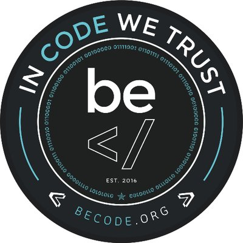

# Dev junior, Sami El Nakadi

## Beginner web developper

Voici quelques liens vers mes réseaux:
* [Linkedin](http://www.linkedin.com) 

Ceci est un beau Readme, dans le but de m'entrainer et de m'habituer à l'utilisation de Markdown ainsi que de Git et du Terminal.

Crée le 18 janvier 2019
A Charleroi; lors de la formation BeCode.

J'en suis au début de la formation, des modifications viendront par la suite, en fonction de l'évolution de mes compétences!

